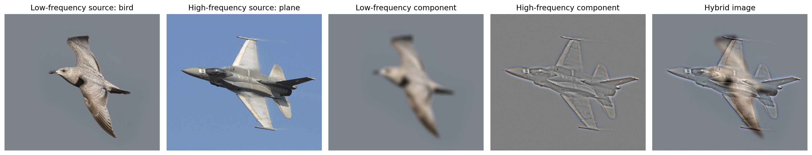

# Image Filtering and Hybrid Images

A computer-vision project that combines Gaussian low- and high-frequency components to produce hybrid images using 2D spatial correlation with NumPy.

A hybrid image is one that changes its predominant interpretation depending on the viewing distance: the high frequency detail is more visible at close range and the low frequency structure dominates at a distance.

[View and run the notebook on Kaggle](https://www.kaggle.com/code/marioyouchia/image-filtering-and-hybrid-images)

## Project Overview

The notebook implements the complete workflow for:

- Creating normalized two-dimensional Gaussian kernels.
- Applying spatial correlation with NumPy.
- Extracting low-frequency image components.
- Extracting high-frequency residuals.
- Combining complementary frequency components into hybrid images.

## Hybrid-Image Method

For each aligned image pair:

1. A Gaussian filter is applied to the first image to preserve its low-frequency component.
2. A blurred version of the second image is subtracted from the original to isolate high-frequency detail.
3. The low-frequency and high-frequency components are combined.
4. The hybrid image is displayed at multiple scales to demonstrate how perception changes with viewing distance.

## Results

### Dog and Cat

### Einstein and Marilyn

### Bird and Plane

## Run the Notebook

The recommended way to run the project is through the Kaggle notebook:

[https://www.kaggle.com/code/marioyouchia/image-filtering-and-hybrid-images](https://www.kaggle.com/code/marioyouchia/image-filtering-and-hybrid-images)

## Dependencies

The notebook uses:

- Python
- NumPy
- OpenCV
- Pillow
- Matplotlib
- Jupyter Notebook
