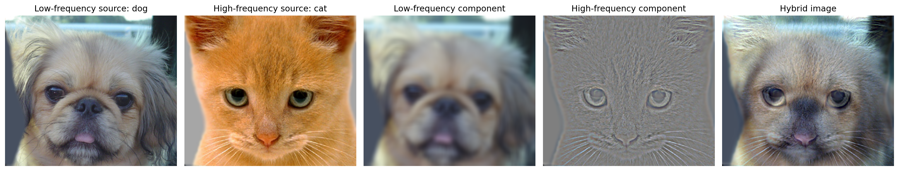
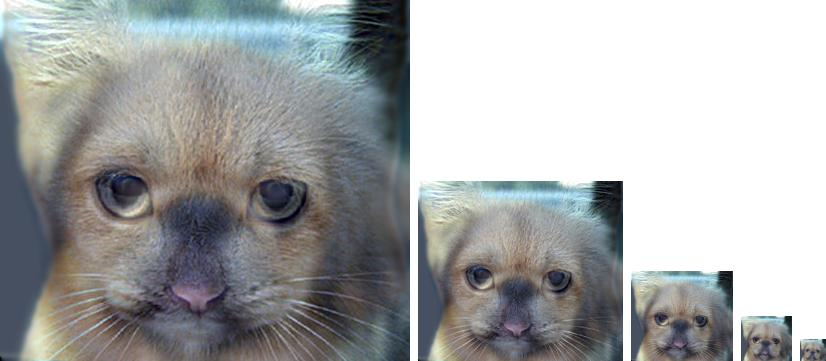
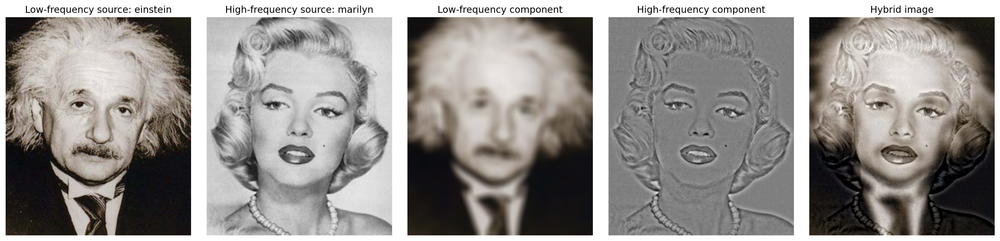

# Image Filtering and Hybrid Images

A computer-vision project that implements spatial image filtering directly with NumPy and uses Gaussian low-pass and high-pass components to construct hybrid images. A hybrid image changes its dominant interpretation with viewing distance because high-frequency structure is emphasized up close while low-frequency structure remains visible from farther away.



## Main Features

- Direct implementation of two-dimensional correlation for grayscale and RGB images.
- Support for constant, reflected, and edge padding.
- Validation of odd-dimensional kernels.
- Programmatic generation of normalized two-dimensional Gaussian kernels.
- Extraction of low- and high-frequency image components.
- Hybrid-image generation from aligned source pairs.
- Multi-scale visualization for observing distance-dependent perception.
- Reproducible result generation for three supplied image pairs.

## Method

For two aligned images, the first image is filtered with a Gaussian kernel to retain its low-frequency structure. The same Gaussian response is subtracted from the second image to isolate high-frequency detail. The two components are then added and clipped to the displayable intensity range.



Additional examples are included for the Einstein-Marilyn and bird-plane pairs.




## Repository Structure

```text
.
├── data/                       # Aligned source image pairs
├── public/images/projects/     # README and portfolio images
├── results/                    # Generated frequency components and hybrids
├── scripts/generate_results.py # Reproduces all saved results
├── src/hybrid_images.py        # Filtering and hybrid-image implementation
└── requirements.txt
```

## Run the Project

Create an environment and install the dependencies:

```bash
python -m venv .venv
source .venv/bin/activate
pip install -r requirements.txt
```

Generate all outputs:

```bash
PYTHONPATH=. python scripts/generate_results.py
```

## Technical Notes

The filtering routine does not call a ready-made convolution or correlation function. It creates local image windows with NumPy and computes the weighted response directly. The implementation returns an output with the same spatial dimensions as the input and supports both grayscale and color images.

## Course Context

Developed for the Computer Vision course at the University of Science and Technology, Zewail City, during Spring 2023.

## Kaggle Notebook

The delivery package includes a self-contained Kaggle notebook at `kaggle/image-filtering-and-hybrid-images.ipynb`. It reads from the shared **Computer Vision Assets** Dataset and generates its results under `/kaggle/working/outputs`.

After publication, add the public Kaggle URL to the portfolio project entry.
